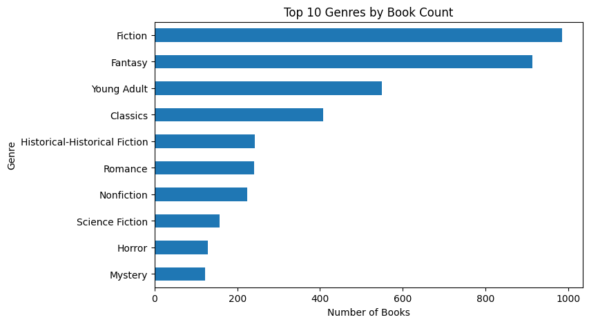
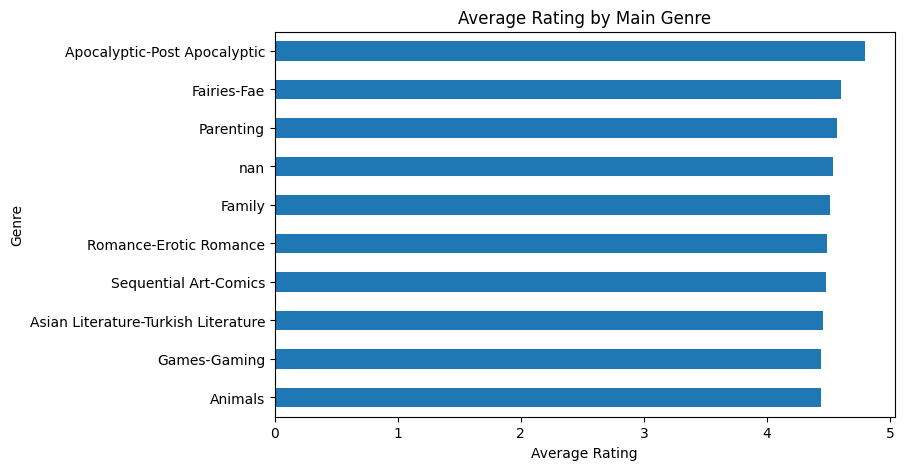
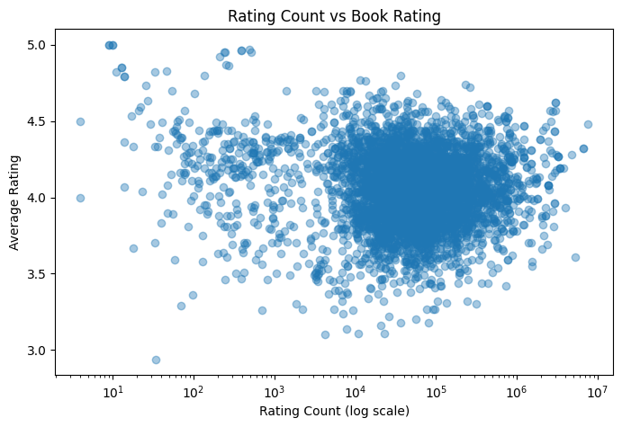
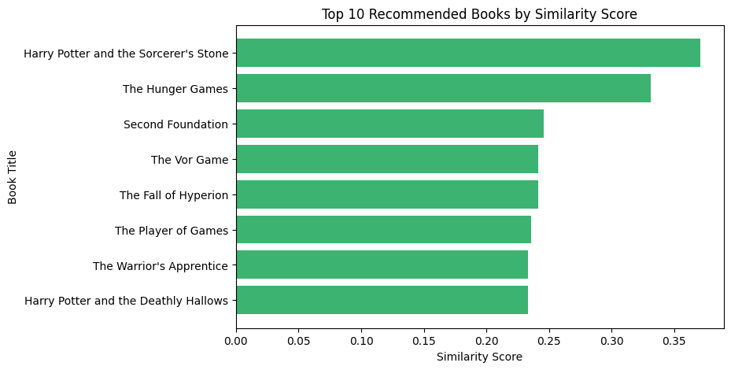

# 📚 SmartReads: Genre-Specific Book Recommender

**SmartReads** is a content-based recommendation system that suggests books within the same genre by analyzing their descriptions and metadata.  
Built using **TF-IDF + Cosine Similarity**, it ranks recommendations by a weighted mix of **similarity**, **popularity**, and **quality** to create personalized, genre-aware suggestions.

---

## 🚀 Features
- Filters books by selected genre (e.g., *Science Fiction*, *Fantasy*, etc.)
- Combines **book descriptions** and **genres** to compute textual similarity
- Ranks results by:
  - *Similarity* between book texts  
  - *Popularity* (rating count + review count)  
  - *Quality* (average rating)
- Interactive **visualizations** showing:
  - Top 10 genres by book count  
  - Average rating by main genre  
  - Relationship between rating count and rating  
  - Similarity scores for top recommendations

---

## 🧠 Tech Stack
- **Python**, **Pandas**, **NumPy**  
- **scikit-learn** for TF-IDF & Cosine Similarity  
- **Matplotlib** for visualizations  
- **Jupyter / Google Colab** for exploration

---

## 📁 Project Structure
```
smartreads-book-recommender/
│
├── data/
│   └── raw/
│       └── goodreads_genre_clean_5k.csv
│
├── notebooks/
│   └── genre_recommender.ipynb
│
├── assets/
│   ├── viz_top_genres.png
│   ├── viz_avg_rating.png
│   ├── viz_rating_vs_count.png
│   └── viz_recommendations.png
│
├── requirements.txt
└── README.md
```

---

## 🧩 How to Run
1. Clone this repo  
   ```bash
   git clone https://github.com/adobamenphoebe/smartreads-book-recommender.git
   cd smartreads-book-recommender
   ```
2. Install dependencies  
   ```bash
   pip install -r requirements.txt
   ```
3. Run the notebook  
   ```bash
   jupyter notebook notebooks/genre_recommender.ipynb
   ```

Or open directly in **Google Colab**:  
[📘 Open in Colab](https://colab.research.google.com/github/adobamenphoebe/smartreads-book-recommender/blob/main/notebooks/genre_recommender.ipynb)

---

## 🎨 Sample Visualizations

**Top 10 Genres by Book Count**  


**Average Rating by Main Genre**  


**Rating Count vs Book Rating**  


**Top 10 Recommended Books by Similarity Score**  


---

## 🧾 Example Output
> *Input:* “space opera” in Science Fiction  
> *Output:* Top 10 most similar sci-fi books ranked by similarity, rating, and review count.

---

## 👩🏽‍💻 Author
Built by **Phoebe Adobamen**  
*B.S. Data Science & Economics @ Drexel University*  
[LinkedIn](https://www.linkedin.com/in/phoebeadobamen) | [GitHub](https://github.com/adobamenphoebe)
